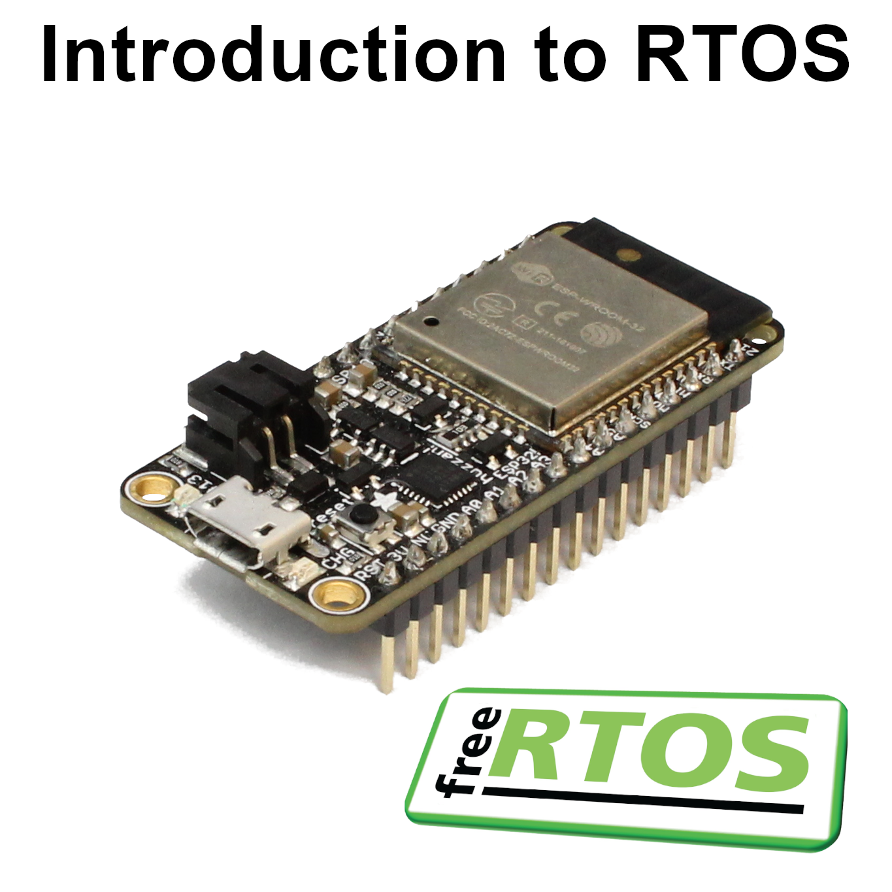

# Introduction to Real Time Operating Systems (RTOS)

Welcome to the demo code and solutions section of my Introduction to RTOS course! This repository houses all of the example code and solutions that you may use as references when working through the RTOS examples for FreeRTOS. 



This course is hosted on YouTube that you may take for free. All you need to do is watch the videos and complete the challenge issued at the end of each video. I highly recommend you try each challenge before peeking at the solutions here. The PowerPoint slides are also made available (under the CC BY 4.0 license) if you wish to use or modify them for review or teaching your own RTOS class. If you use the slides, please give credit to **Shawn Hymel** and **Digi-Key Electronics** in your slides (as per the [CC BY 4.0 requirements](https://creativecommons.org/licenses/by/4.0/)).

> Want to try the code without hardware? Check out *aslansq*'s implementation of this series with QEMU: [https://github.com/aslansq/freertos_intro_qemu](https://github.com/aslansq/freertos_intro_qemu)

| Chapter | Title | Video | Solution | Slides |
|---------|-------|-------|----------|--------|
| 01 | What is an RTOS | [[video]](https://www.youtube.com/watch?v=F321087yYy4&list=PLEBQazB0HUyQ4hAPU1cJED6t3DU0h34bz&index=1) | [[solution]](https://www.digikey.com/en/maker/projects/what-is-a-realtime-operating-system-rtos/28d8087f53844decafa5000d89608016) | [[slides]](01-what-is-an-rtos/rtos-part-01.pptx?raw=true) |
| 02 | Getting Started with freeRTOS | [[video]](https://www.youtube.com/watch?v=JIr7Xm_riRs&list=PLEBQazB0HUyQ4hAPU1cJED6t3DU0h34bz&index=2) | [[solution]](https://www.digikey.com/en/maker/projects/introduction-to-rtos-solution-to-part-2-freertos/b3f84c9c9455439ca2dcb8ccfce9dec5) | [[slides]](02-getting-started-with-freertos/rtos-part-02.pptx?raw=true) |
| 03 | Task Scheduling and Management | [[video]](https://www.youtube.com/watch?v=95yUbClyf3E&list=PLEBQazB0HUyQ4hAPU1cJED6t3DU0h34bz&index=3) | [[solution]](https://www.digikey.com/en/maker/projects/introduction-to-rtos-solution-to-part-3-task-scheduling/8fbb9e0b0eed4279a2dd698f02ce125f) | [[slides]](03-task-scheduling-and-management/rtos-part-03.pptx?raw=true) |
| 04 | Memory Allocation | [[video]](https://www.youtube.com/watch?v=Qske3yZRW5I&list=PLEBQazB0HUyQ4hAPU1cJED6t3DU0h34bz&index=4) | [[solution]](https://www.digikey.com/en/maker/projects/introduction-to-rtos-solution-to-part-4-memory-management/6d4dfcaa1ff84f57a2098da8e6401d9c) | [[slides]](04-memory-allocation/rtos-part-04.pptx?raw=true) |
| 05 | Queue | [[video]](https://www.youtube.com/watch?v=pHJ3lxOoWeI&list=PLEBQazB0HUyQ4hAPU1cJED6t3DU0h34bz&index=5) | [[solution]](https://www.digikey.com/en/maker/projects/introduction-to-rtos-solution-to-part-5-freertos-queue-example/72d2b361f7b94e0691d947c7c29a03c9) | [[slides]](05-queue/rtos-part-05.pptx?raw=true) |
| 06 | Mutex | [[video]](https://www.youtube.com/watch?v=I55auRpbiTs&list=PLEBQazB0HUyQ4hAPU1cJED6t3DU0h34bz&index=6) | [[solution]](https://www.digikey.com/en/maker/projects/introduction-to-rtos-solution-to-part-6-freertos-mutex-example/c6e3581aa2204f1380e83a9b4c3807a6) | [[slides]](06-mutex/rtos-part-06.pptx?raw=true) |
| 07 | Semaphore | [[video]](https://www.youtube.com/watch?v=5JcMtbA9QEE&list=PLEBQazB0HUyQ4hAPU1cJED6t3DU0h34bz&index=7) | [[solution]](https://www.digikey.com/en/maker/projects/introduction-to-rtos-solution-to-part-7-freertos-semaphore-example/51aa8660524c4daba38cba7c2f5baba7) | [[slides]](07-semaphore/rtos-part-07.pptx?raw=true) |
| 08 | Software Timer | [[video]](https://www.youtube.com/watch?v=b1f1Iex0Tso&list=PLEBQazB0HUyQ4hAPU1cJED6t3DU0h34bz&index=8) | [[solution]](https://www.digikey.com/en/maker/projects/introduction-to-rtos-solution-to-part-8-software-timers/0f64cf758da440a29476165a5b2e577e) | [[slides]](08-software-timer/rtos-part-08.pptx?raw=true) |
| 09 | Hardware Interrupts | [[video]](https://www.youtube.com/watch?v=qsflCf6ahXU&list=PLEBQazB0HUyQ4hAPU1cJED6t3DU0h34bz&index=9) | [[solution]](https://www.digikey.com/en/maker/projects/introduction-to-rtos-solution-to-part-9-hardware-interrupts/3ae7a68462584e1eb408e1638002e9ed) | [[slides]](09-hardware-interrupts/rtos-part-09.pptx?raw=true) |
| 10 | Deadlock and Starvation | [[video]](https://www.youtube.com/watch?v=hRsWi4HIENc&list=PLEBQazB0HUyQ4hAPU1cJED6t3DU0h34bz&index=10) | [[solution]](https://www.digikey.com/en/maker/projects/introduction-to-rtos-solution-to-part-10-deadlock-and-starvation/872c6a057901432e84594d79fcb2cc5d) | [[slides]](10-deadlock/rtos-part-10.pptx?raw=true) |
| 11 | Priority Inversion | [[video]](https://www.youtube.com/watch?v=C2xKhxROmhA&list=PLEBQazB0HUyQ4hAPU1cJED6t3DU0h34bz&index=11) | [[solution]](https://www.digikey.com/en/maker/projects/introduction-to-rtos-solution-to-part-11-priority-inversion/abf4b8f7cd4a4c70bece35678d178321) | [[slides]](11-priority-inversion/rtos-part-11.pptx?raw=true) |
| 12 | Multicore Systems | [[video]](https://www.youtube.com/watch?v=LPSHUcH5aQc&list=PLEBQazB0HUyQ4hAPU1cJED6t3DU0h34bz&index=12) | [[solution]](https://www.digikey.com/en/maker/projects/introduction-to-rtos-solution-to-part-12-multicore-systems/369936f5671d4207a2c954c0637e7d50) | [[slides]](12-multicore/rtos-part-12.pptx?raw=true) |

## Directory Structure

Examples and solutions are housed in dirctories that correspond to each chapter or video number. For example, if you watch "Intro to RTOS Part 3 - Task Scheduling," you should refer to the directory *03-task-scheduling-and-management.* In it, you will find 2 directories, one marked "demo" that gives the finished demo code used during the video (so you may run it and examine it at your own pace) and another marked "solution" that provides one possible solution to the challenge issued at the end of the video.

If a challenge is issued in a video that starts with some code, it will be listed as a *challenge* Arduino sketch in the naming scheme shown below.

Directories are in the following structure (where xx is the part or chapter number):

```
xx-<name of chapter>/
|- esp32-freertos-xx-challenge-<name>/
|- esp32-freertos-xx-demo-<name>/
|- esp32-freertos-xx-solution-<name>/
|- rtos-part-xx.pptx
```

PowerPoint slides used in each video can be found within the respective *xx-<name of chapter>* directory.

The only exception to this is the *images* directory, which is where I keep images for this repository.

## License

PowerPoint slides are licensed under the [Creative Commons CC BY 4.0 license](https://creativecommons.org/licenses/by/4.0/). You are welcome to use and modify them for your own review and teaching. If you use them, please give credit to **Shawn Hymel** and **Digi-Key Electronics**.

All code in this repository, unless otherwise noted, is licensed under the [Zero-Clause BSD / Free Public License 1.0.0 (0BSD)](https://opensource.org/licenses/0BSD).

Permission to use, copy, modify, and/or distribute this software for any purpose with or without fee is hereby granted.

THE SOFTWARE IS PROVIDED "AS IS" AND THE AUTHOR DISCLAIMS ALL WARRANTIES WITH REGARD TO THIS SOFTWARE INCLUDING ALL IMPLIED WARRANTIES OF MERCHANTABILITY AND FITNESS. IN NO EVENT SHALL THE AUTHOR BE LIABLE FOR ANY SPECIAL, DIRECT, INDIRECT, OR CONSEQUENTIAL DAMAGES OR ANY DAMAGES WHATSOEVER RESULTING FROM LOSS OF USE, DATA OR PROFITS, WHETHER IN AN ACTION OF CONTRACT, NEGLIGENCE OR OTHER TORTIOUS ACTION, ARISING OUT OF OR IN CONNECTION WITH THE USE OR PERFORMANCE OF THIS SOFTWARE.
